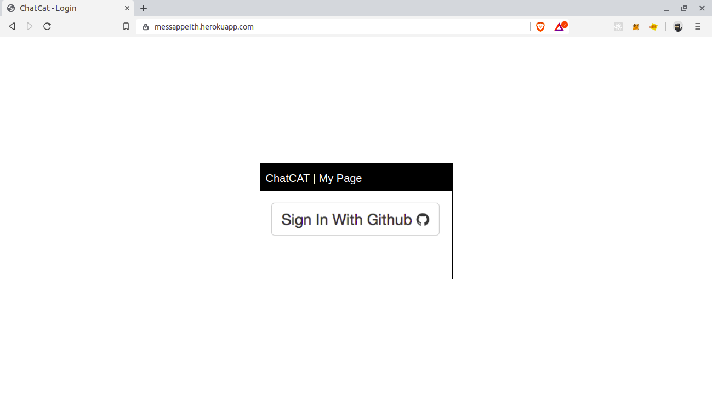
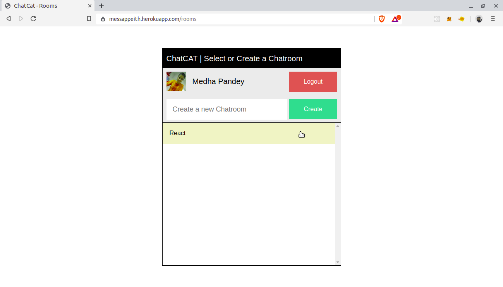
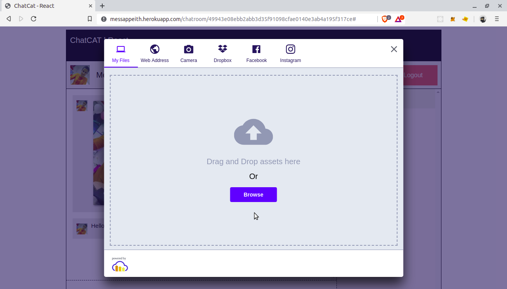
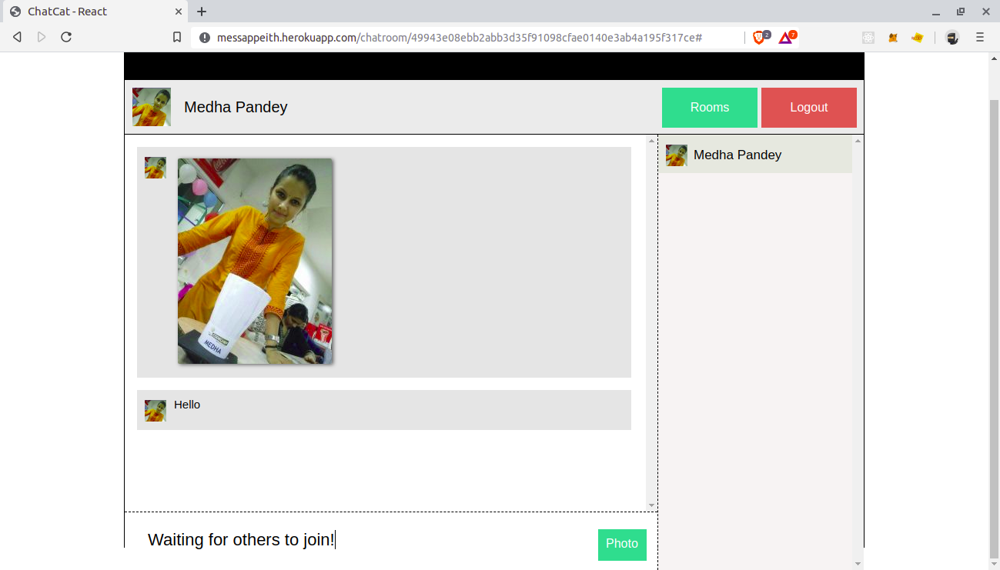

# ChatCat

A MultiRoom Chat App

- [x] Build a production ready NodeJs App - A Multi Room Chat App
- [x] Structure a NodeJS App
- [x] Using Express Framework
  - [x] Implement `Routing`
  - [x] Implement `Custom MiddleWare`
  - [x] Implement `Sessions`
  - [ ] Implement `Logging`
- [x] Use MongoDB as a service via `MongoLab.com/` Use MongoDB
- [x] Implement websocket using `Socket.io`
- [x] Implement `Social authentication` using facebook and twitter
- [x] Deploy on the cloud on `Heroku`
- [x] Use `ES6 features`

ScreenShots

 
 
 
 

Find the app on [Website Link](https://messappeith.herokuapp.com)